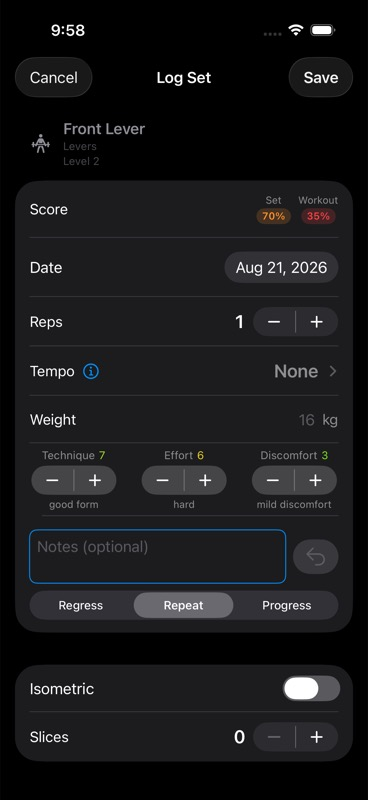
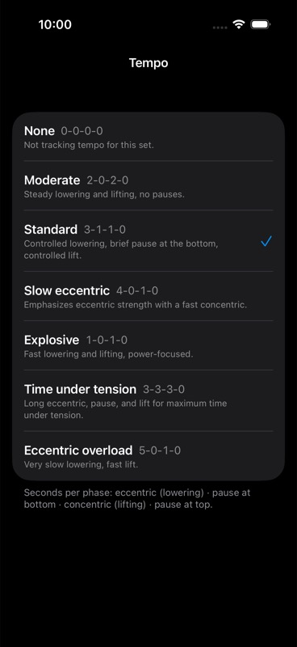

# SetLogKit

Shared set-logging sheet and scoring logic for training apps: a drop-in `RatedSetForm`
UI plus the pure-function scoring, progression, and workout-segmenting logic behind it.

## Requirements

- iOS 17+ / macOS 14+
- Swift 5.9+

## Installation

```swift
.package(url: "https://github.com/sphericalwave/SetLogKit.git", branch: "main")
```

## Screenshots

<p>
  
  
</p>

`RatedSetForm` (score, reps, tempo, equipment, TED metrics, notes, decision) and the
tempo preset picker pushed from the Tempo row.

## Overview

- `SetRecord` — read-only face a persisted set presents to SetLogKit's logic; host apps conform their own model (SwiftData `@Model`, CoreData, plain struct)
- `RatedSetSkill` / `RatedSetForm` — the shared set-logging sheet. Conform a skill type + supply an `EquipmentModel` (from EquipmentKit) to get score chips, reps, TED metrics, notes, decision, isometric/slices, and the equipment slot for free
- `RatedSetFormConfig`, `RatedSetDraft`, `RatedSetEntry`, `PriorSet` — form configuration and state types
- `NoEquipment` — no-op `EquipmentModel` for skills with no equipment input
- `CompletionScorer` / `CompletionSettings` — completion scoring for a set
- `ProgressionEvaluator` / `ProgressionDecision` / `RatedSet` — Intuitive Training Protocol: suggests progress/repeat/regress from the last 3 logged sets (sustained RPT ≥ 8, RPD ≤ 3, RPE ≥ 6 across 3 sessions → progress; high RPD or low RPT → regress; otherwise repeat)
- `WorkoutSegmenter` / `WorkoutSegment` — segments a workout's logged sets
- `FalseColor` — false-color mapping for metric visualization
- `HRConfig` / `HRStats` — heart-rate stats display config
- `TempoCoachView` — guided rep counter: speaks the set's tempo aloud one beat per second ("rep three, lower / two / three / hold / extend"), counts the reps you finish, and writes the count back into the form's Reps field. Enable with `RatedSetFormConfig(showsTempo: true, showsTempoCoach: true)`
- `TempoScript` / `TempoPhase` / `TempoPhaseNames` — the cue script behind it: pure, per-second beats with substitutable phase wording. Zero-second phases are skipped; the target rep count marks a cue but doesn't end the set, so an overrun still counts
- UI widgets: `CompletionChip`, `TEDMetricStepper`, `MetricStepperRow`, `HRStatRow`, `TEDDescription`

## Source layout

Views are split by platform; everything else is shared and platform-agnostic.

```
Sources/SetLogKit/
  Shared/    Scoring, Progression, Records, Equipment, ViewModels,
             RatedSetFormTypes (the public contract),
             RatedSetFormSections (the fields both platforms show),
             Tempo (the coach's cue script, beat clock, and voice seam),
             Views/Components (widgets that render identically)
  iOS/       RatedSetForm — nav-bar chrome, sheet sized by the system
             TempoCoach — full-screen readout, large bottom action button
  macOS/     RatedSetForm — pinned sheet size, grouped form, bottom
             Cancel/Save bar
             TempoCoach — pinned sheet size, bottom action bar
```

Both platform files declare the same public type — `RatedSetForm`, `TempoCoachView` —
each guarded by `#if os(...)`, so consumers see one type with one initializer. `#if` inside a
shared view body is not the pattern here — the only exceptions are the
cosmetic shims in `Shared/Modifiers/PlatformModifiers.swift`.

## Dependencies

- [EquipmentKit](https://github.com/sphericalwave/EquipmentKit) (remote, branch `main`)
- [WorkoutAudioKit](https://github.com/sphericalwave/WorkoutAudioKit) (remote, branch `main`) — the tempo coach's speech and tones

## Host app

`HostApp/RatedSetFormHarness` is a standalone harness app for previewing/testing
`RatedSetForm` in isolation, with a UI test target.
